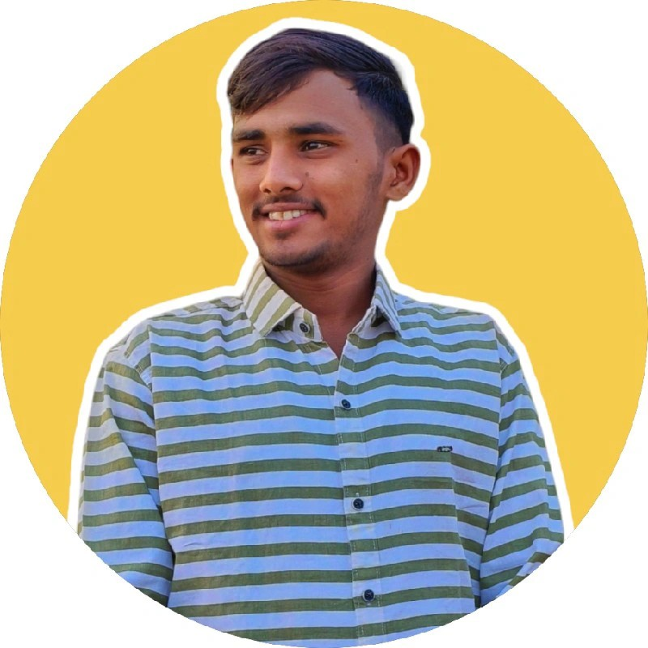

<!-- Profile Header -->

  

<h1 align="center">Hi, I'm Vishal Talsaniya 👋</h1>

  <b>Backend Developer | Golang Enthusiast | BCA Student</b> 
  <i>"Building scalable systems, one API at a time."</i>

  <a href="assets/Vishal Talsaniy_Backend_resume.pdf">📄 Download Resume</a> •
  <a href="https://linkedin.com/in/vishaltalsaniya" target="_blank">LinkedIn</a>

---

### 👨‍💻 About Me

> **“I believe learning by building is the fastest path to growth.”**

I'm a backend developer passionate about scalable APIs, clean code, and real-world system design.  
Skilled in **Golang**, **MySQL**, **Docker**, **RabbitMQ**, and always exploring more—like AWS and cloud architecture.  
Currently learning **VoIP technologies** with **FreeSWITCH** and **Kamailio** for real-time communication systems.

#### 🎯 Goals
- ✅ Contribute to open-source backend projects  
- ✅ Get my first backend internship  
- ✅ Master system design & scalable architecture  
- ✅ Learn VoIP with FreeSWITCH & Kamailio

---

### 🛠️ Skills

---

### 🏢 Experience

**Siprtc**  
*Backend Developer Intern*  
Dec 2024 – Present
- Designed scalable REST APIs using Go
- Built features like JWT auth, file uploads, background tasks
- Used Docker, RabbitMQ, MySQL, MVC pattern, and GORM
- Started learning and applying VoIP with **FreeSWITCH** and **Kamailio**

**ATMIYA University**  
*BCA Student*  
Jun 2022 – Dec 2024
- Built multiple academic and personal backend projects
- Gained deep hands-on experience in Go, MySQL, and Docker

---

### 🚀 Projects

#### CRM System
*Go, MySQL, RabbitMQ*  
Full-fledged system with user auth, file uploads, and analytics built using Go, MySQL, and RabbitMQ  
[🔗 GitHub](https://github.com/Vishaltalsaniya-7)

---

### 📫 Contact

- **Email:** [vishaltalsaniya991@gmail.com](mailto:vishaltalsaniya991@gmail.com)  
- **Location:** Limboda, Botad - 364720, Gujarat  
- **LinkedIn:** [linkedin.com/in/vishaltalsaniya](https://linkedin.com/in/vishaltalsaniya)  
- **GitHub:** [github.com/vishaltalsaniya](https://github.com/vishaltalsaniya)

---

  Built with ❤️ by Vishal Talsaniya | © 2025

